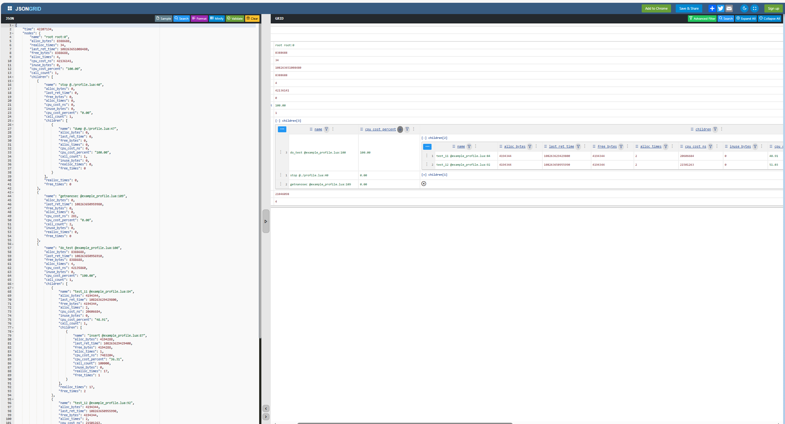

# Build

```
git clone https://github.com/antsmallant/luaprofile.git
cd luaprofile && sh build.sh
```

---

# Example

## run script
```
cd example && sh run-example-profile.sh
```

## view result 

The result is a json file : example_result.json .
We can view it in a better way using https://jsongrid.com/ .
Just open the file, and paste the content to jsongrid, then we can see the cost and the children. 



---

# Credits

lvzixun https://github.com/lvzixun/luaprofile

lsg2020 https://github.com/lsg2020/luaprofile


